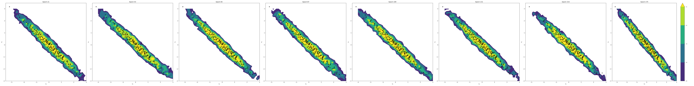
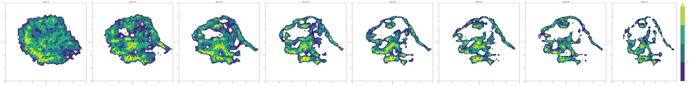

# Simple Information-theoretic diffusion

A repository for the ICLR 2023 paper 
[Information-Theoretic Diffusion](https://openreview.net/forum?id=UvmDCdSPDOW)
containing simplified examples. 

This repository is simplified compared to the [main repository](https://github.com/kxh001/ITdiffusion/):
1. Only consider *continuous* density estimation (most diffusion papers do 
treating pixels as discrete)
2. Omits the ensembling which improves results but complicates the code 
3. Treats the log-logistic distribution (location, scale) as hyper-parameters (see below), rather than estimating them as did in the paper. 
4. Pytorch lightning is used to simplify boilerplate, 
and makes it easier to exploit different compute resources. 

## BibTeX
```
@inproceedings{
kong2023informationtheoretic,
title={Information-Theoretic Diffusion},
author={Xianghao Kong and Rob Brekelmans and Greg {Ver Steeg}},
booktitle={International Conference on Learning Representations},
year={2023},
url={https://openreview.net/forum?id=UvmDCdSPDOW} }
```

## Requirements

To install requirements:

```setup
pip install numpy scipy matplotlib scikit-learn torch torchvision pytorch-lightning tensorboard diffusers
```

## Train and evaluate 2D examples

To train and generate figures, run this script.
```train
python train_2d.py --dataset {dino,moons,scg,line,circle}
```
Statistics and image outputs appear in tensorboard. 
```log
tensorboard --logdir .
```
The main ideas can be read in the class in diffusionmodel.py. 
The diffusion model takes a denoising architecture as input (arguments are input and log SNR, output is size of input).
This simplified code assumes continuous density estimation, and requires specifying the log SNR range 
(see discussion below).

## Train on CIFAR-10

TODO: working minimal example coming soon. The main repository contains the paper code ()

```train
python train_cifar10.py
```
MSE curves and log likelihoods are tracked in tensorboard. 
Checkpoints are saved automatically by Pytorch Lightning. 


### Fixing the log SNR sampling parameters
This is the equivalent step to fixing the noise scheduler in other papers. 
In our paper, we found that the logistic distribution over log SNR values is optimal 
for Gaussians and a good choice for more complex distributions like CIFAR too. 
We only need to estimate two parameters, the location and scale of this distribution. 
In the paper, we estimate them from the spectrum of the data. 

However, it may be simpler to estimate these parameters directly by looking at the MSE 
curves.
To empirically set these hyper-parameters, run the diffusion model once with the 
default values, and then use tensorboard to look at the MSE plot. 


Ideally, you'd set the location, logsnr_loc to be the 50 percent quantile, 
and the scale to be the distance from the 50 percent quantile to the 25th or 75th percent quantile.
(Note the maximum value for MSE should be d, so you should divide by d to interpret these as quantiles.)
More heuristically, you want the location to be in the middle of the largest gap 
between the MMSE Gaussian curve, and the true MSE curve. This is also a good way to 
diagnose training, as we should always do at least as well as the Gaussian MMSE. 


## Results

We visualize the density as contour plots using
$\log p(x) = c + 1/2 \int mmse(x,\alpha) d\alpha$, as discussed in the paper. 
Samples of each distribution are also plotted for reference. 

### Gaussian 
The strongly correlated Gaussian is a nice test case. We know the true entropy  (1.22 nats) and can check 
that our validation loss approaches this number. 




### Dino
A fun, highly nonlinear density, that is strongly peaked on a low-dimensional manifold.



### Moons
A classic example - we can see that we have a low density chasm that splits the two clusters. 


### Circle


### Line

Expected to have sharp edges that are not well-modeled. 


## References

Inspired by the [tiny diffusion](https://github.com/tanelp/tiny-diffusion) repo. 
To reproduce results in the paper, see our [main repository](https://github.com/kxh001/ITdiffusion/).
